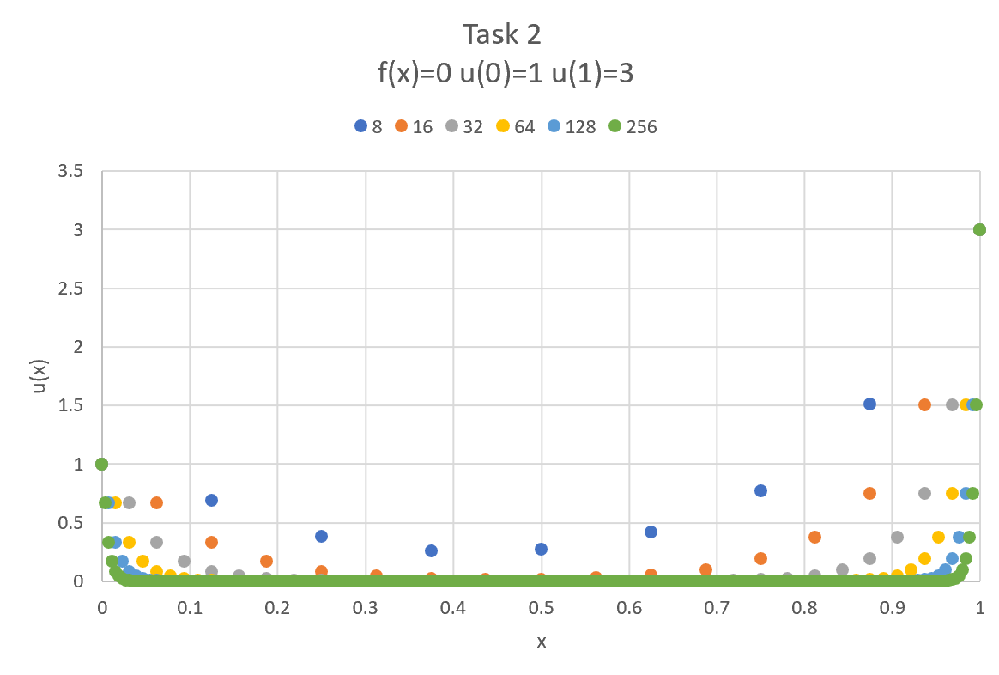
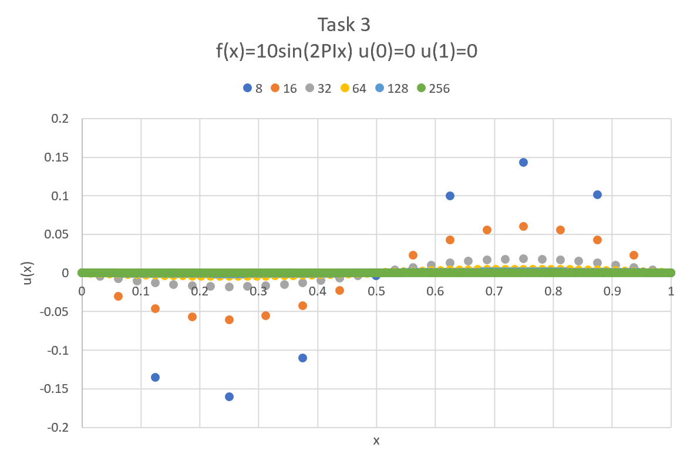
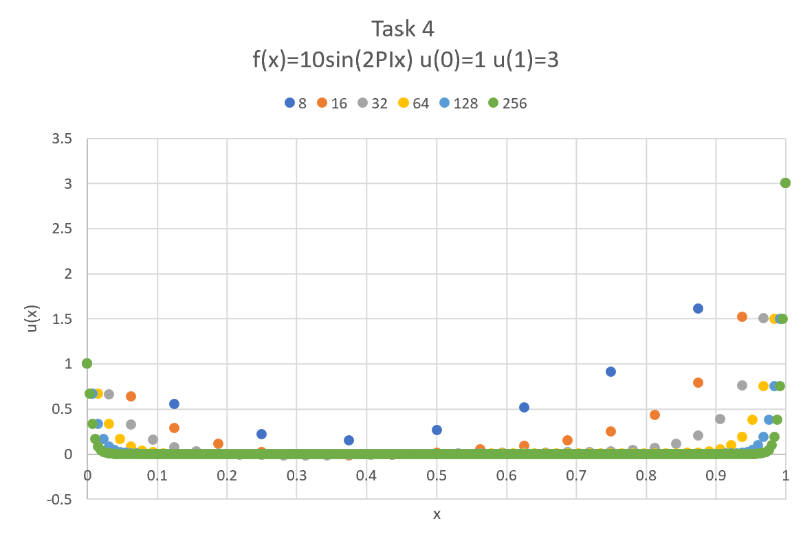

# Homework 3

## Task 1

Made a Java class that will use LU Decomposition to solve an elliptic problem with Dirichlet boundary conditions.

[Software Manuel for LUDecomp](https://github.com/clarissalabrum/math5620/blob/master/homework/hw3/LUDecomp.md)

[Code for LUDecomp](https://github.com/clarissalabrum/math5620/blob/master/homework/hw3/LUDecomp.java)

## Task 2

The data for tasks 2, 3, and 4 can all be found on the following
excel sheet.

[Task 2, 3, and 4 data](https://github.com/clarissalabrum/math5620/blob/master/homework/hw3/HW3_data.xlsx)

Table of f(x) = 0, u(0) = 1, u(1) = 3

## Task 3

Table of f(x) = 10sin(2PIx), u(0) = 0, u(1) = 0

## Task 4

Table of f(x) = 10sin(2PIx), u(0) = 1, u(1) = 3

## Task 5

Made a Java class that will use LU Decomposition to solve an elliptic problem with Neumann boundary conditions.

[Software Manuel for NeumannLUDecomp](https://github.com/clarissalabrum/math5620/blob/master/homework/hw3/NeumannLUDecomp.md)

[Code for NeumannLUDecomp](https://github.com/clarissalabrum/math5620/blob/master/homework/hw3/NeumannLUDecomp.java)

## Task 6

Neumann boundary conditions are in the form of first derivatives (e.g. u'(0)=3 and u'(1)=5) while Dirichlet boundary conditions are of the form u(0)=4. Dirichlet boundary conditions can be considered through the usual finite difference methods while the Neumann boundary conditions require more consideration. To take the boundary conditions into account we need to use a finite difference approximation with order of error O(h^2). THis is typically done with one sided finite difference methods.

[Wolfram Mathworld](http://mathworld.wolfram.com/BoundaryConditions.html)

[Neumann](https://www.sciencedirect.com/topics/mathematics/neumann-boundary-condition)

[Intro to BVP](https://people.sc.fsu.edu/~jpeterson/bvp.pdf)
