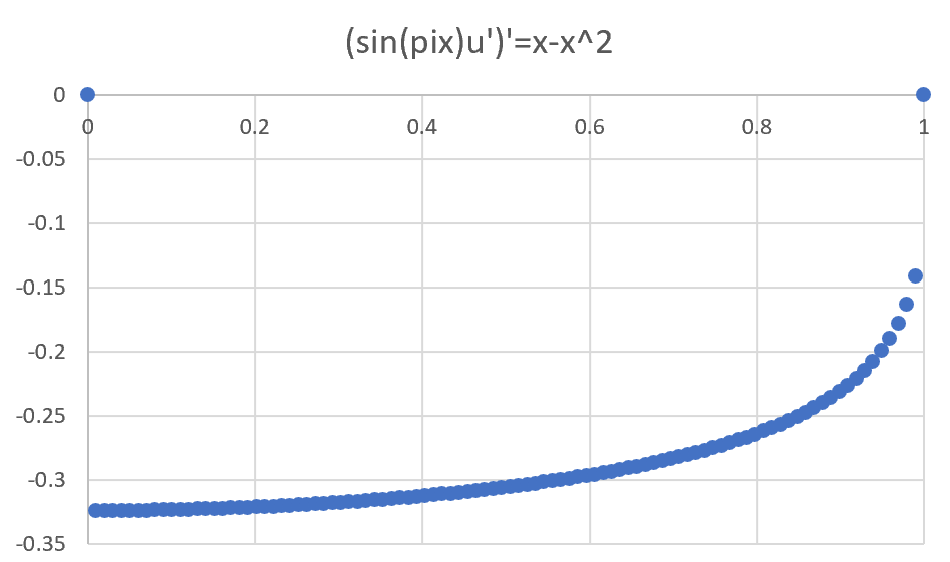

# Homework 4

## Task 1

The finite difference code for a basic general linear elliptic problem is linearTridiag. It takes an array of coefficients and returns a 
tridiagional matrix in the form of a two dimensional array.

[linearTridiag Code]()

[linearTridiag Software Manual](https://github.com/clarissalabrum/math5620/blob/master/homework/hw4/linearTridiag.md)

To solve the system of linear equations **AU=F** one would use the following 
commands in order.

    double[][] A = TridiagMatrix.linearTridiag(a.length, a);
    double[] F = TridiagMatrix.rhs(f, alpha, beta, h, size);
    double[] U = TridiagMatrix.solver(F, A, size);

## Task 2

Not sure on what the computation convergence analysis is but I found the
exact solution and ran linearTridiag code with the same parameters and found the difference
between the two of them.

For this problem:
* u(0) = u(1) = 0
* f(x) = x-x^2
* k(x) = 1
* n = 100

The exact solution is 1/6 x^3 - 1/12 x^4 - 1/12 x

I made an excel sheet recording the data.

[Task2 Excel Data]()

The average difference between them is 0.00041 which is about 4h^2.

## Task 3

The exact solution could not be found but the linearTridiag process
results are the following graph.

For this problem:
* u(0) = u(1) = 0
* f(x) = x-x^2
* k(x) = sin(pix)
* n = 100

[Task3 Excel Data]()

## Task 4

Could not find the instructor given array of values for k(x) but I would
simply set the array ***a*** defined in linearTridiag software manual to the 
given array and run the code.
    
## Task 5

Only code needed to write was linearTridiag.

[linearTridiag Software Manual]()

Previous methods in TridiagMatrix Class were modified

[tridiag Software Manual]()

[rhs Software Manual]()

[solver SoftwareManual]()

## Task 6

Math24 helped me realize that problems in the form (k(x)u')'=f(x) are 
equivalent to u'' + p(x)u' = h(x). Solving equations of this form has the 
same process as if p(x) and h(x) were constant. The difference between
the initial value problems of this form and the boundary value problems
is that the boundary value problems do not guarantee uniqueness and existence.

[Math24](https://www.math24.net/second-order-linear-homogeneous-differential-equations-constant-coefficients/)

[personal.psu](http://www.personal.psu.edu/sxt104/class/Math251/Notes-2nd%20order%20ODE%20pt1.pdf)